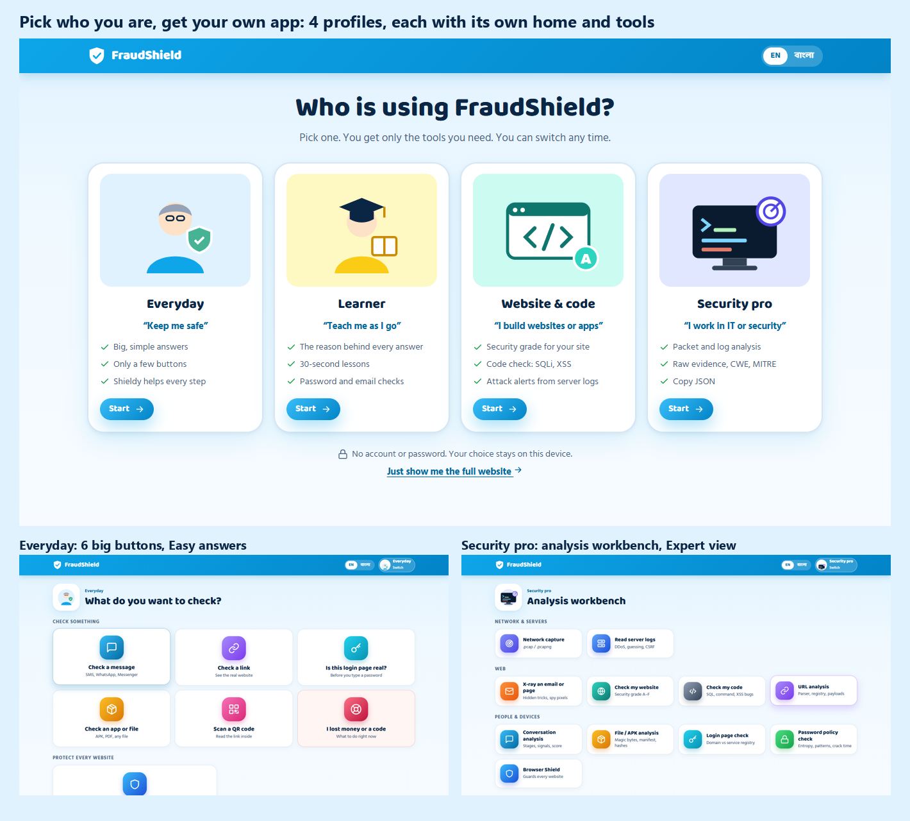
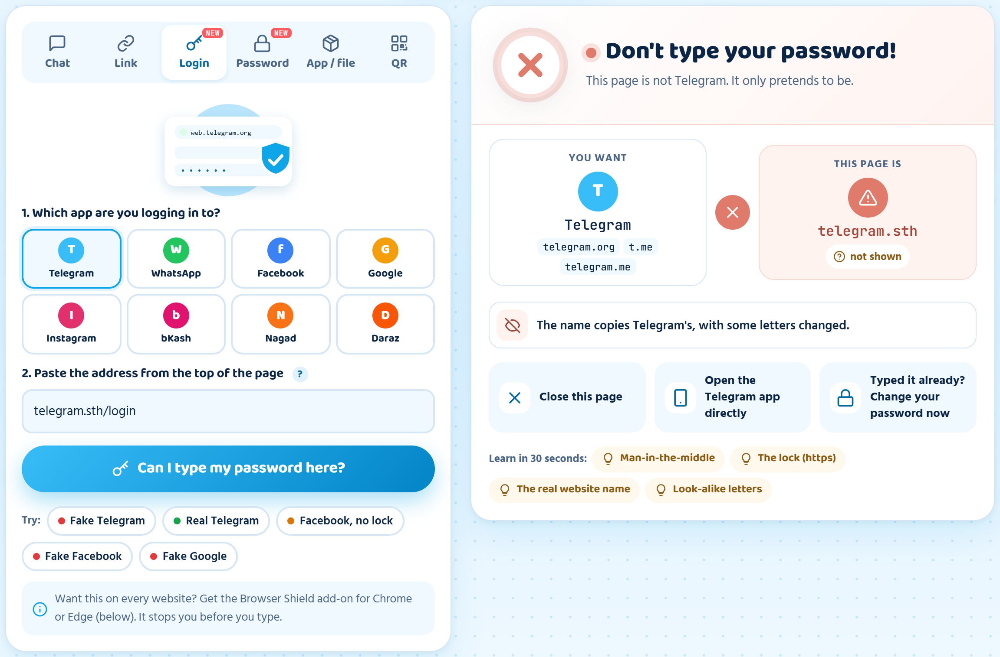
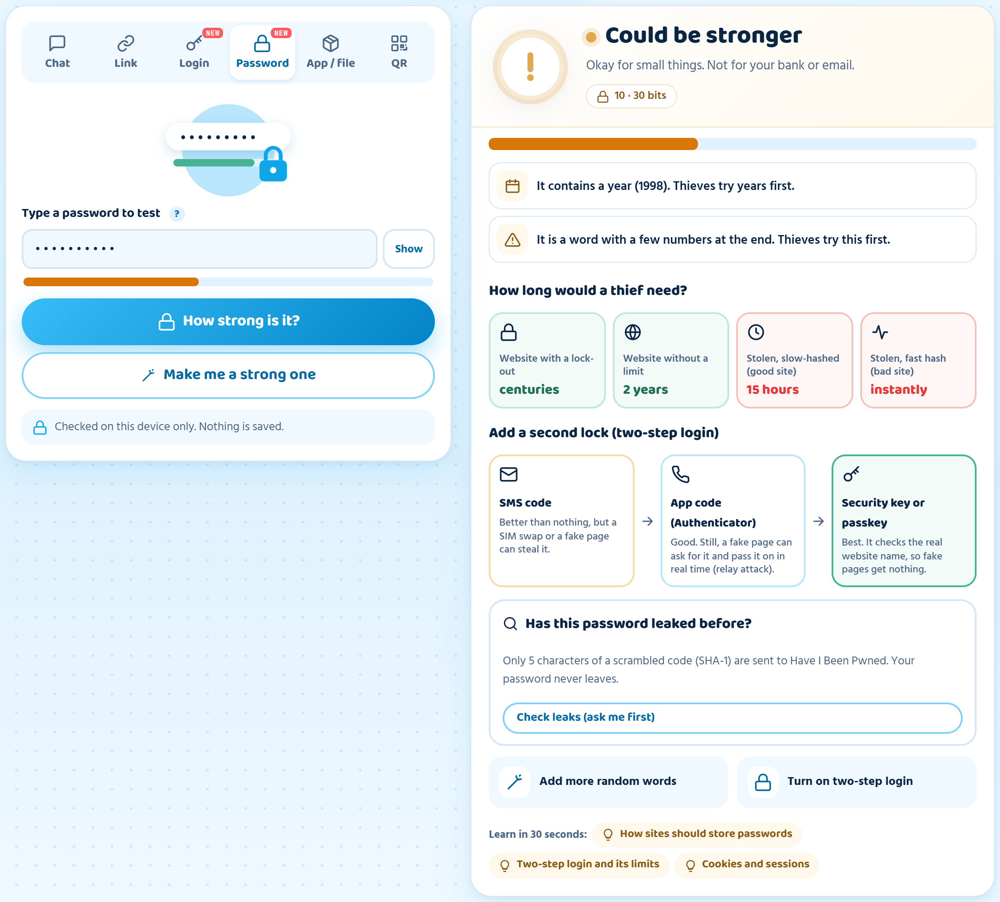
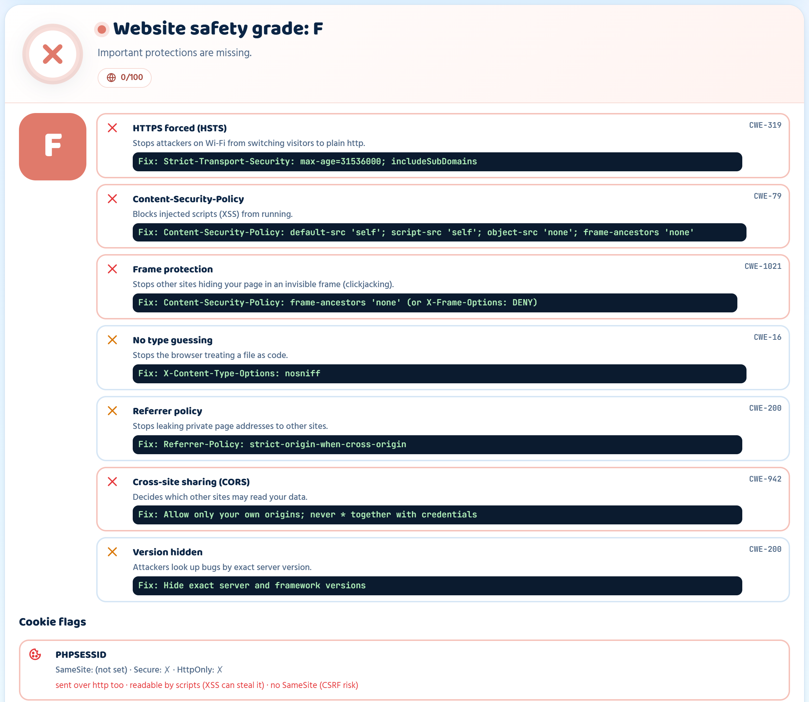
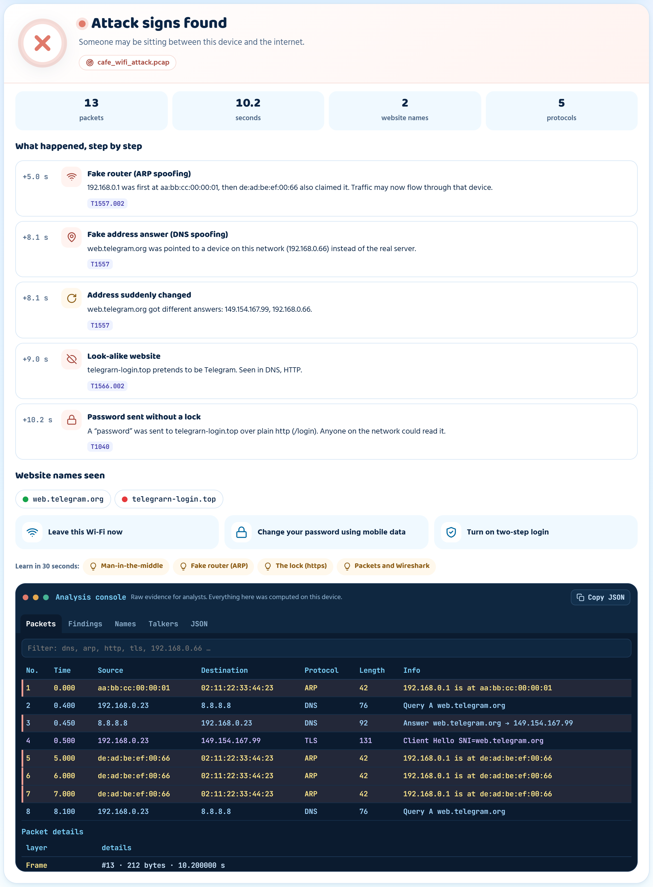
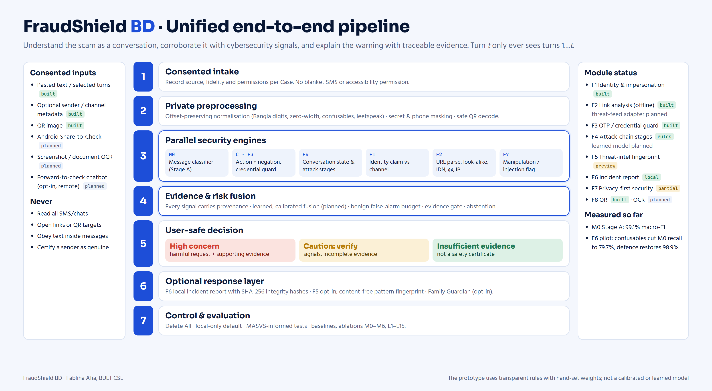
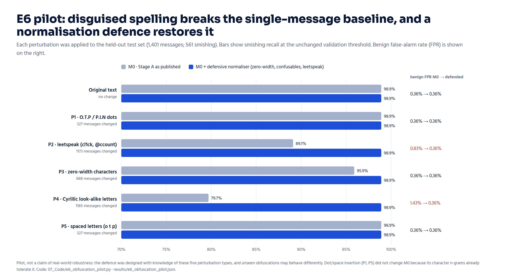

# FraudShield BD

Scam protection and security learning for people in Bangladesh, in Bangla and English. It checks chats, links, login pages, apps and passwords before you act, explains *why* something is dangerous, and includes tools for developers and IT teams. Everything runs in the browser; nothing is uploaded.

**Live demo:** https://fablihakhan.github.io/fraudshield-bd/



## Why

Most scams here do not arrive as one obviously bad message. Someone claims to be from bKash, builds trust over a few messages, adds pressure, and only then asks for the OTP. Existing Bangla tools look at one message at a time, and most people were never taught how these tricks work. I only learned most of it in my fourth-year web-security course.

## What it does

When you open it, it asks who you are and gives you only the tools you need:

| Profile | Tools |
|---|---|
| **Everyday** | Check a chat (turn by turn), check a link, "is this login page real?", check an app / APK or file, scan a QR code, what to do after losing money |
| **Learner** | The same checks with explanations, 25 short lessons (phishing, OTP, man-in-the-middle, XSS, CSRF, clickjacking, SQL injection, password hashing, 2FA…), a password check, an email / page X-ray |
| **Website & code** | Security grade for a website's headers and cookies, a code check for injection and XSS, server-log alerts |
| **Security pro** | Wi-Fi capture (.pcap) analysis, log forensics, URL / file / conversation analysis with MITRE ATT&CK and CWE tags, JSON export |

Every result can be shown at three levels: **Easy** (what to do), **Learn** (why) and **Expert** (raw evidence).

There is also a **Browser Shield** add-on for Chrome and Edge ([`extension/`](extension/)). It pauses you before typing a password on a look-alike or unencrypted page, makes invisible click-jacking frames unclickable, and holds back forms a page tries to send to another site on its own.

| | |
|---|---|
|  |  |
|  |  |

## How the chat check works

For every new message, using only the messages so far, the engine:

1. cleans the text (Bangla digits, invisible characters, look-alike letters, leetspeak);
2. finds what is being asked (code, PIN, money, link, app) and whether it is a request or a warning ("never share your PIN");
3. compares who they claim to be with who is actually sending;
4. parses any link without opening it;
5. tracks the stages of the scam (hook → trust → pressure → request).

It answers **High concern**, **Caution: verify** or **Insufficient evidence**, and quotes the evidence. It never says "safe". The weights are set by hand for now, so the score is an indicator, not a probability.



## Findings so far

Experiments on the public Bengali SMS Smishing dataset (7,005 messages in Bangla, Banglish, English and code-mixed; details in [`research/`](research/)):

| Test | Result |
|---|---|
| Single-message baseline (TF-IDF + logistic regression), test macro-F1 | **0.991** (95% CI 0.986–0.996) |
| Same, after removing 156 near-duplicates of training messages | 0.990 |
| Harmful requests caught when shown messages from the middle of a conversation | 0 of 2 |
| Genuine messages wrongly flagged in the same probe | 2 of 4 |
| Scam recall with Cyrillic look-alike letters | drops from 0.989 to **0.797** |
| Same, with the text-cleaning defence | back to **0.989** |

A single-message model scores well on the benchmark but misses scams that build up over a conversation. That gap is what this project works on. The look-alike result is a pilot: the defence was designed knowing the attack types.



## Project structure

```
index.html          the app (built, self-contained)
jsQR.js             QR decoding library
src/                app source, build script, sample generators, tests
extension/          Browser Shield add-on (load unpacked) and its zip
research/           Python experiments, data splits, results, data schema
samples/            harmless test files: QR images, APKs, a disguised PDF, Wi-Fi captures, server logs
docs/images/        screenshots and figures
```

## Run it

- **App:** open `index.html` in a browser (keep `jsQR.js` next to it for QR scanning), or use the live demo.
- **Rebuild:** `python src/build.py`
- **Tests:** `node src/tests/run_tests.js` (129 checks)
- **Browser Shield:** open `chrome://extensions`, turn on Developer mode, click **Load unpacked** and select the `extension/` folder.
- **Research:** see [`research/README.md`](research/README.md).

## Limitations

- The checks are hand-written rules, so they can miss new tricks or warn on safe things.
- Conversation-level learned models and a labelled Bangla conversation dataset are the next step, not done yet.
- Screenshot reading (OCR) and an Android app are planned.
- The Browser Shield is a prototype: it installs in developer mode and checks the top page only.

All sample messages and files are fictional. This project is not affiliated with bKash, Nagad, Rocket or any bank.

## Author

Fabliha Afia, Department of CSE, Bangladesh University of Engineering and Technology (BUET)
